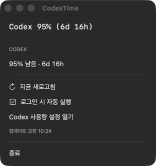

# CodexTime

[](https://github.com/sundaynighttt/codextime/actions/workflows/ci.yml)
[](https://github.com/sundaynighttt/codextime/releases/latest)
[](LICENSE)

Codex를 쓰다 보면 남은 사용량과 리셋 시간을 확인하기 위해 매번 설정 화면을 열어야 합니다.

**그게 불편해서 만들었습니다.**

CodexTime은 Codex의 남은 사용량과 리셋까지 남은 시간을 항상 짧게 보여주는 무료 오픈소스 앱입니다.

- **macOS:** 상단 메뉴바에 `Codex 95% (6d 16h)` 표시
- **Windows:** 작업표시줄에 `Codex 95% · 6d 16h` 표시
- Windows에서는 우상단 미니 위젯으로 전환 가능
- 별도 OpenAI API 키 불필요
- 광고·분석·텔레메트리 없음

> CodexTime은 OpenAI의 공식 제품이 아닌 커뮤니티 프로젝트입니다. Codex의 실험적 `app-server` 프로토콜을 사용하므로 Codex 업데이트에 따라 수정이 필요할 수 있습니다.

## 화면



화면의 수치는 개인정보 노출을 막기 위한 예시 값입니다.

## 다운로드

최신 버전은 [GitHub Releases](https://github.com/sundaynighttt/codextime/releases/latest)에서 받을 수 있습니다.

| 운영체제 | 파일 | 지원 환경 |
| --- | --- | --- |
| macOS | `CodexTime-macOS-<버전>.dmg` | macOS 13 이상 |
| Windows | `CodexTime-Windows-<버전>.zip` | Windows 10/11 |

두 버전 모두 [Codex CLI](https://learn.chatgpt.com/docs/codex/cli)가 설치되어 있고 ChatGPT 계정으로 로그인되어 있어야 합니다.

```text
codex --version
codex login status
```

## macOS 설치

1. DMG 파일을 엽니다.
2. **Codex Usage Monitor**를 Applications 폴더로 옮깁니다.
3. 앱을 실행하면 상단 메뉴바에 사용량이 표시됩니다.

공개 DMG는 Developer ID로 서명하고 Apple 공증을 완료했습니다. 로그인 시 자동 실행은 메뉴에서 켜고 끌 수 있습니다.

## Windows 설치

1. ZIP 파일의 압축을 풉니다.
2. 해당 폴더에서 PowerShell을 엽니다.
3. 다음 명령을 실행합니다.

```powershell
powershell -ExecutionPolicy Bypass -File .\install.ps1 -EnableStartup
```

기본 화면은 오른쪽 알림 영역 옆의 작은 사용량 표시입니다. 클릭하면 상세 사용량을 볼 수 있고, 오른쪽 클릭 메뉴에서 새로고침·우상단 미니 위젯·자동 실행·종료를 선택할 수 있습니다.

Windows 실행 파일과 설치 스크립트는 아직 코드 서명되지 않았습니다. 필요한 경우 공개된 소스를 확인하고 릴리스의 `SHA256SUMS.txt`로 파일 무결성을 검증하세요.

삭제하려면 CodexTime을 종료한 뒤 다음 명령을 실행합니다.

```powershell
powershell -ExecutionPolicy Bypass -File "$env:LOCALAPPDATA\CodexUsageMonitor\uninstall.ps1"
```

## 개인정보와 보안

- 설치된 Codex CLI의 기존 로그인을 사용합니다.
- `auth.json`, 브라우저 쿠키, 액세스 토큰을 직접 읽지 않습니다.
- CodexTime이 읽은 사용량 데이터를 별도 서버로 전송하지 않습니다.
- 광고·사용자 분석·텔레메트리가 없습니다.
- 소스 코드와 빌드 과정이 모두 공개되어 있습니다.

인증 파일이나 토큰은 버그 제보에 첨부하지 마세요. 보안 문제는 [SECURITY.md](SECURITY.md)를 참고하세요.

## 직접 빌드하고 확인하기

저장소를 내려받으면 전체 동작을 직접 확인하고 빌드할 수 있습니다.

macOS:

```bash
swift test --package-path macos
./macos/scripts/build-macos.sh
```

Windows(.NET 8 SDK 필요):

```powershell
powershell -ExecutionPolicy Bypass -File .\windows\test-parser.ps1
.\windows\package-windows.ps1 -Version 0.2.0
```

CodexTime은 `codex app-server`를 짧게 실행해 `account/rateLimits/read` 결과만 읽습니다. 사용한 비율을 남은 비율로 바꾸고, 리셋 시각을 남은 시간으로 표시합니다. 자세한 필드와 통신 순서는 [docs/protocol.md](docs/protocol.md)에 정리되어 있습니다.

기여 방법은 [CONTRIBUTING.md](CONTRIBUTING.md), 전체 라이선스는 [MIT License](LICENSE)를 참고하세요.

## English

CodexTime is a free, open-source macOS menu-bar and Windows taskbar app that shows your remaining Codex allowance and reset countdown. Download the latest DMG or ZIP from [GitHub Releases](https://github.com/sundaynighttt/codextime/releases/latest). It uses your existing Codex CLI login and includes no analytics or telemetry.
