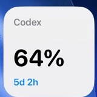

# CodexTime

[](https://github.com/sundaynighttt/codextime/actions/workflows/ci.yml)
[](https://github.com/sundaynighttt/codextime/releases/latest)
[](LICENSE)

Codex를 쓰다 보면 남은 사용량과 리셋 시간을 확인하기 위해 매번 설정 화면을 열어야 합니다.

**그게 불편해서 만들었습니다.**

CodexTime은 Codex의 남은 사용량과 리셋까지 남은 시간을 항상 짧게 보여주는 무료 오픈소스 앱입니다.

- **macOS:** 상단 메뉴바에 `Codex 95%` 표시, 필요하면 리셋 시간도 함께 표시
- **Windows:** 작업표시줄에 `Codex 95% · 6d 16h` 표시
- **iPhone:** 홈 화면 소형 위젯에 `Codex (갱신 시각) / 95% / 3d 17h / 누적 토큰` 표시
- Windows에서는 우상단 미니 위젯으로 전환 가능
- 별도 OpenAI API 키 불필요
- 광고·분석·텔레메트리 없음

> CodexTime은 OpenAI의 공식 제품이 아닌 커뮤니티 프로젝트입니다. 데스크톱은 Codex의 `app-server`, iPhone은 기기 로그인·계정 사용량 인터페이스를 사용합니다. 외부 서비스 변경에 따라 수정이 필요할 수 있습니다.

<!-- project-release-ledger:start -->
## 릴리스 기준과 전체 버전 흐름

> 자동 관리 원장: [`docs/releases/release-ledger.json`](docs/releases/release-ledger.json) · 갱신일: `2026-09-04`

### 현재 기준선

| 기준 | 버전 | 단계 | 상태 | 요약 | 근거 |
| --- | --- | --- | --- | --- | --- |
| iPhone 최신 후보<br>`latest_candidate` | **`1.0 (9)`** | `external_processed` | `active` | 예시 모드·개인정보·이용 안내, 14개 테스트 및 CI 통과; 2026-09-04 09:55 KST App Store 심사 제출 완료·심사 대기 중, 승인 및 수동 출시 전 | [project.yml](ios/project.yml)<br>[submission.md](docs/app-store/submission.md) |
| Apple 처리 확인 최신<br>`last_external` | **`1.0 (9)`** | `external_processed` | `active` | 예시 모드·개인정보·이용 안내, 14개 테스트 및 CI 통과; 2026-09-04 09:55 KST App Store 심사 제출 완료·심사 대기 중, 승인 및 수동 출시 전 | [project.yml](ios/project.yml)<br>[submission.md](docs/app-store/submission.md) |
| 데스크톱 공개 최신<br>`latest_desktop_release` | **`v0.2.3`** | `released` | `historical` | macOS 메뉴바 표시 복구 | `git:v0.2.3`<br>[외부 근거](https://github.com/sundaynighttt/codextime/releases/tag/v0.2.3) |

### 전체 버전 흐름

| 순서 | 날짜 | 버전 | 단계 | 상태 | 요약 | 근거 |
| ---: | --- | --- | --- | --- | --- | --- |
| 1 | 2026-08-26 | `v0.1.0` | `released` | `historical` | 최초 macOS 공개 배포 | `git:v0.1.0`<br>[외부 근거](https://github.com/sundaynighttt/codextime/releases/tag/v0.1.0) |
| 2 | 2026-08-26 | `v0.1.1` | `released` | `historical` | macOS 서명·공증 공개본 | `git:v0.1.1`<br>[외부 근거](https://github.com/sundaynighttt/codextime/releases/tag/v0.1.1) |
| 3 | 2026-08-26 | `windows-v0.2.0` | `released` | `historical` | Windows 상시 표시 WPF 사전 배포 | `git:windows-v0.2.0`<br>[외부 근거](https://github.com/sundaynighttt/codextime/releases/tag/windows-v0.2.0) |
| 4 | 2026-08-26 | `v0.2.0` | `released` | `historical` | 한국어 중심 공개 안내 및 데스크톱 배포 | `git:v0.2.0`<br>[외부 근거](https://github.com/sundaynighttt/codextime/releases/tag/v0.2.0) |
| 5 | 2026-08-26 | `v0.2.1` | `released` | `historical` | 설치 앱 아이콘 추가 | `git:v0.2.1`<br>[외부 근거](https://github.com/sundaynighttt/codextime/releases/tag/v0.2.1) |
| 6 | 2026-08-26 | `v0.2.2` | `released` | `historical` | 간결한 사용량 표시 설정 | `git:v0.2.2`<br>[외부 근거](https://github.com/sundaynighttt/codextime/releases/tag/v0.2.2) |
| 7 | 2026-08-26 | `v0.2.3` | `released` | `historical` | macOS 메뉴바 표시 복구 | `git:v0.2.3`<br>[외부 근거](https://github.com/sundaynighttt/codextime/releases/tag/v0.2.3) |
| 8 | 2026-08-28 | `0.3.0 (1)` | `external_processed` | `historical` | 최초 iPhone 전용·암호화 설정 및 내부 전용 테스트; 2026-09-04 ASC 처리 상태 확인, 설치 수만으로 smoke 통과를 추정하지 않음 | `git:4a58f5a`<br>[submission.md](docs/app-store/submission.md) |
| 9 | 2026-08-28 | `0.3.0 (2)` | `external_processed` | `historical` | 일반 TestFlight 업로드 빌드; 2026-09-04 ASC 처리 상태 확인, 설치 수만으로 smoke 통과를 추정하지 않음 | `git:24be6f8`<br>[submission.md](docs/app-store/submission.md) |
| 10 | 2026-08-28 | `0.3.0 (3)` | `external_processed` | `historical` | 기기 로그인 대기 유지; 2026-09-04 ASC 처리 상태 확인, 설치 수만으로 smoke 통과를 추정하지 않음 | `git:eb80e99`<br>[submission.md](docs/app-store/submission.md) |
| 11 | 2026-08-28 | `0.3.0 (4)` | `external_processed` | `historical` | 위젯 새로고침 버튼; 2026-09-04 ASC 처리 상태 확인, 설치 수만으로 smoke 통과를 추정하지 않음 | `git:13a95d9`<br>[submission.md](docs/app-store/submission.md) |
| 12 | 2026-08-28 | `0.3.0 (5)` | `external_processed` | `historical` | 위젯 갱신 시각 표시; 2026-09-04 ASC 처리 상태 확인, 설치 수만으로 smoke 통과를 추정하지 않음 | `git:cd2139c`<br>[submission.md](docs/app-store/submission.md) |
| 13 | 2026-08-30 | `0.3.0 (6)` | `external_processed` | `historical` | 위젯 누적 토큰 표시; 2026-09-04 ASC 처리 상태 확인, 설치 수만으로 smoke 통과를 추정하지 않음 | `git:df50a6e`<br>[submission.md](docs/app-store/submission.md) |
| 14 | 2026-09-03 | `0.3.0 (7)` | `external_processed` | `historical` | 위젯 새로고침 버튼 정렬; 2026-09-04 ASC 처리 상태 확인, 설치 수만으로 smoke 통과를 추정하지 않음 | `git:d9f37ad`<br>[submission.md](docs/app-store/submission.md) |
| 15 | 2026-09-03 | `0.3.0 (8)` | `external_processed` | `historical` | 위젯 갱신 시각을 제목 오른쪽 괄호로 이동; 2026-09-04 ASC 처리 상태 확인, 설치 수만으로 smoke 통과를 추정하지 않음 | `git:df03b4d`<br>[submission.md](docs/app-store/submission.md) |
| 16 | 2026-09-04 | `1.0 (9)` | `external_processed` | `active` | 예시 모드·개인정보·이용 안내, 14개 테스트 및 CI 통과; 2026-09-04 09:55 KST App Store 심사 제출 완료·심사 대기 중, 승인 및 수동 출시 전 | [project.yml](ios/project.yml)<br>[submission.md](docs/app-store/submission.md) |
<!-- project-release-ledger:end -->

## 화면

macOS 메뉴바:


iPhone 소형 위젯:



화면의 수치는 개인정보 노출을 막기 위한 예시 값이며, macOS 화면은 리셋 시간 표시를 켠 상태입니다.

## 다운로드

최신 버전은 [GitHub Releases](https://github.com/sundaynighttt/codextime/releases/latest)에서 받을 수 있습니다.

| 운영체제 | 파일 | 지원 환경 |
| --- | --- | --- |
| macOS | `CodexTime-macOS-<버전>.dmg` | macOS 13 이상 |
| Windows | `CodexTime-Windows-<버전>.zip` | Windows 10/11 |

두 버전 모두 [Codex CLI](https://learn.chatgpt.com/docs/codex/cli)가 설치되어 있고 ChatGPT 계정으로 로그인되어 있어야 합니다.

```text
codex --version
codex login status
```

iPhone은 **1.0(9) App Store 심사 대기 중**이며 아직 일반 공개되지 않았습니다. 2026-09-04 정식 심사에 제출했으며, 기존 0.3.0(1–8)은 TestFlight 내부 테스트 이력입니다. 정식 설치 링크는 Apple 승인 및 수동 출시 후 추가합니다. Codex CLI나 켜져 있는 Mac 없이 본인의 ChatGPT 계정을 직접 연결하며, 로그인 없는 **예시 데이터로 둘러보기**도 제공합니다. 예시는 앱과 위젯에 명확히 표시되고 실제 계정 캐시와 분리됩니다. [iPhone 안내](ios/README.md) · [제출 현황](docs/app-store/submission.md)

## macOS 설치

1. DMG 파일을 엽니다.
2. **Codex Usage Monitor**를 Applications 폴더로 옮깁니다.
3. 앱을 실행하면 상단 메뉴바에 사용량이 표시됩니다. 메뉴에서 리셋 시간 표시 여부를 선택할 수 있습니다.

기본 표시는 메뉴바 공간을 적게 쓰는 `Codex 95%` 형식입니다. 화면 연결 상태가 바뀌거나 잠자기에서 돌아오면 메뉴바 항목을 다시 표시합니다. 항목이 보이지 않을 때 앱을 한 번 더 열어도 복원됩니다. 공개 DMG는 Developer ID로 서명하고 Apple 공증을 완료했습니다. 로그인 시 자동 실행은 메뉴에서 켜고 끌 수 있습니다.

## Windows 설치

1. ZIP 파일의 압축을 풉니다.
2. 해당 폴더에서 PowerShell을 엽니다.
3. 다음 명령을 실행합니다.

```powershell
powershell -ExecutionPolicy Bypass -File .\install.ps1 -EnableStartup
```

기본 화면은 오른쪽 알림 영역 옆의 작은 사용량 표시입니다. 클릭하면 상세 사용량을 볼 수 있고, 오른쪽 클릭 메뉴에서 새로고침·우상단 미니 위젯·자동 실행·종료를 선택할 수 있습니다.

Windows 실행 파일과 설치 스크립트는 아직 코드 서명되지 않았습니다. 필요한 경우 공개된 소스를 확인하고 릴리스의 `SHA256SUMS.txt`로 파일 무결성을 검증하세요.

삭제하려면 CodexTime을 종료한 뒤 다음 명령을 실행합니다.

```powershell
powershell -ExecutionPolicy Bypass -File "$env:LOCALAPPDATA\CodexUsageMonitor\uninstall.ps1"
```

## 개인정보와 보안

- macOS와 Windows는 설치된 Codex CLI의 기존 로그인을 사용합니다.
- macOS와 Windows는 `auth.json`, 브라우저 쿠키, 액세스 토큰을 직접 읽지 않습니다.
- iPhone은 OpenAI 기기 로그인으로 받은 토큰을 동기화되지 않는 iOS Keychain에 저장합니다. ID 토큰에는 계정 정보가 포함될 수 있습니다.
- 개발자 자체 서버는 없습니다. 실제 계정 연결 시 OpenAI에 인증·사용량 요청과 네트워크 정보가 전달됩니다.
- 예시 모드는 인증 정보와 네트워크 요청 없이 동작합니다. 실제 계정 연결 해제는 기기의 토큰과 캐시를 지우며 외부 계정을 삭제하지 않습니다.
- 광고·사용자 분석·텔레메트리가 없습니다.
- 소스 코드와 빌드 과정이 모두 공개되어 있습니다.

인증 파일이나 토큰은 버그 제보에 첨부하지 마세요. [개인정보 처리방침](docs/privacy-policy.md)과 [SECURITY.md](SECURITY.md)를 참고하세요.

## 직접 빌드하고 확인하기

저장소를 내려받으면 전체 동작을 직접 확인하고 빌드할 수 있습니다.

macOS:

```bash
swift test --package-path macos
./macos/scripts/build-macos.sh
```

Windows(.NET 8 SDK 필요):

```powershell
powershell -ExecutionPolicy Bypass -File .\windows\test-parser.ps1
.\windows\package-windows.ps1 -Version 0.2.0
```

iPhone(Xcode와 XcodeGen 필요):

```bash
cd ios
xcodegen generate
xcodebuild -project CodexTime.xcodeproj -scheme CodexTime -sdk iphonesimulator build CODE_SIGNING_ALLOWED=NO
```

macOS와 Windows는 `codex app-server`를 짧게 실행해 `account/rateLimits/read` 결과만 읽습니다. iPhone은 기기 로그인 후 ChatGPT 사용량 엔드포인트에서 같은 메타데이터를 직접 읽습니다. 모두 사용한 비율을 남은 비율로 바꾸고, 리셋 시각을 남은 시간으로 표시합니다. 기본 한도 구간을 표시하며 모든 구간이나 API 결제 잔액을 표시하지는 않습니다. 자세한 필드와 통신 순서는 [docs/protocol.md](docs/protocol.md)에 정리되어 있습니다.

기여 방법은 [CONTRIBUTING.md](CONTRIBUTING.md), 전체 라이선스는 [MIT License](LICENSE)를 참고하세요.

## English

CodexTime is a free, open-source app for macOS, Windows, and iPhone that shows your remaining Codex allowance and reset countdown. Download desktop builds from [GitHub Releases](https://github.com/sundaynighttt/codextime/releases/latest). iPhone 1.0(9) was submitted on September 4, 2026 and is waiting for App Store review; approval and manual release are still pending. Its clearly labeled offline example mode is available without an account. Live account access communicates directly with OpenAI; there is no developer-operated backend, advertising, or analytics SDK.
